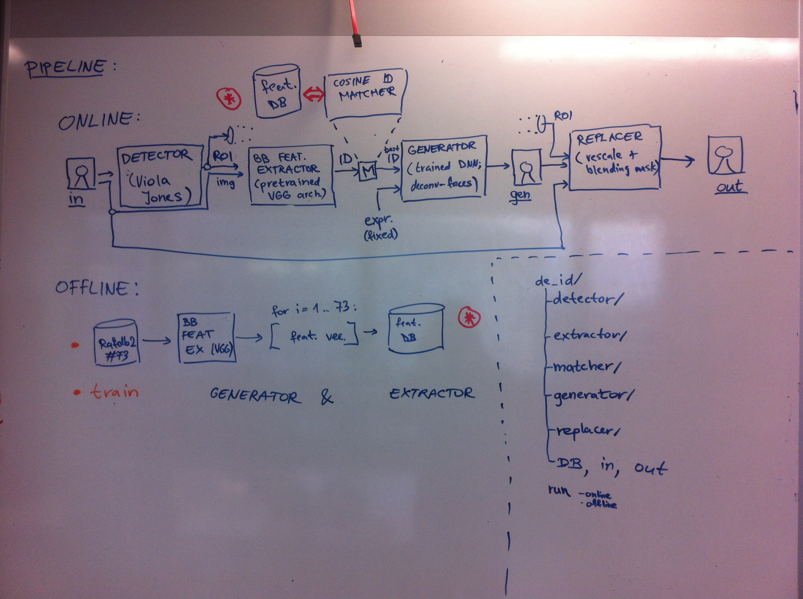

# README #

This README describes how to set-up this project.
[Markdown cheat-sheet to help us editing this readme](https://bitbucket.org/tutorials/markdowndemo).

## What is this repository for? ##

This repository contains face de-identification pipeline. There would be two modes of operation: OFFLINE (used to train, ran only once, to obtain models for ONLINE processing pipeline).

*OFFLINE* processing includes training of Generator and Extractor + converting the image DB to feature vector DB using the Extractor module.

*ONLINE* processing includes whole pipeline as shown on pipeline schematic down below.

The pipeline consists of 5 independent modules, which should be integrated together:

* Detector
    + [(included demo was obtained here: Viola Jones detector demo)](http://docs.opencv.org/3.1.0/d7/d8b/tutorial_py_face_detection.html)
    + DONE: cv2 python demo works
    + TODO: pipeline integration
* Extractor
    + converted version from caffe to keras was provided by @rcmalli (https://github.com/rcmalli/keras-vggface)
    + feature extraction works
    + [pretrained VGG Face model)](http://www.robots.ox.ac.uk/~vgg/software/vgg_face/)
* Matcher
    + PARTIALLY DONE (returned ID is not properly calculated yet - for now its only image index): implement cosine metric & matching (comparing vectors from feature DB and input feature vector, return ID of best match in feature DB)
* Generator 
    + [(included code was obtained here: original github repository)](https://github.com/zo7/deconvfaces)
    + DONE: demo works
    + ***DONE: improve the quality of generated images*** (@rcmalli - optimized parameters, loss convergence was not problematic, @blazm - will try to retrain to see if the problem persists).
    + TODO: pipeline integration
* Replacer
    + PARTIALLY DONE (gauss mask now anonymizes face detections a bit): implement inplace image blending to replace detected ROI from input image with rescaled generated image.

Module integration could be possibly implemented using bash scripts (for now, while we have a lot of different demos & libs for each module) or would be completely developed in python (for faster video processing & parameter passing).

Other repository directories will include:

* in - directory for input data (images, videos)
* out - directory for output data (processed images, videos)
* DB - directory with databases (if needed)



## How do I get set up? ##

Install Generator & Extractor dependencies first, since this was the first tested and configured module which works (the rest of the modules would have to adapt to these dependencies).
Development OS is Ubuntu 16.04. 

### Generator and Extractor dependencies ###

Install Anaconda: https://www.continuum.io/downloads.

Create a conda environment:
```
#!bash

# create environment
conda create -n python35 python=3.5 anaconda

# activate environment
source activate python35

# Install numpy, scipy
pip3 install numpy, scipy

# Download and install tqdm from https://github.com/noamraph/tqdm
pip3 install git+https://github.com/noamraph/tqdm.git

# get TensorFlow (GPU or CPU)
# Ubuntu/Linux 64-bit, GPU enabled, Python 3.5
# Requires CUDA toolkit 8.0 and CuDNN v5. For other versions, see "Install from sources" below.
export TF_BINARY_URL=https://storage.googleapis.com/tensorflow/linux/gpu/tensorflow-0.11.0-cp35-cp35m-linux_x86_64.whl

# or if using CPU only
# Ubuntu/Linux 64-bit, CPU only, Python 3.5
export TF_BINARY_URL=https://storage.googleapis.com/tensorflow/linux/cpu/tensorflow-0.11.0-cp35-cp35m-linux_x86_64.whl

# Install TensorFlow for Python 3
pip3 install --ignore-installed --upgrade $TF_BINARY_URL

# Install Keras
pip3 install keras

# Enter python to check if all modules successfully imported in python
python

```
```
#!python
# When in python try to import all dependencies to see if ok
import numpy, scipy, tqdm
import tensorflow as tf
import keras

```

To run training or generating, please see the scripts generate.sh, train_once.sh


### Detector dependencies ###

```
#!bash
# Install opencv3 to Anaconda
conda install -c menpo opencv3
```

### Matcher dependencies ###

TODO: (only scipy probably, to use cosine metric located in scipy.spatial.distance.cosine(u,v))

### Replacer dependencies ###

TODO (probably only opencv would be needed)

### Other useful informations ###

My directory relations are currently like this (probably not that important, since we work in local environment with python 3.5):

anaconda2/

de-id/ (this repository)